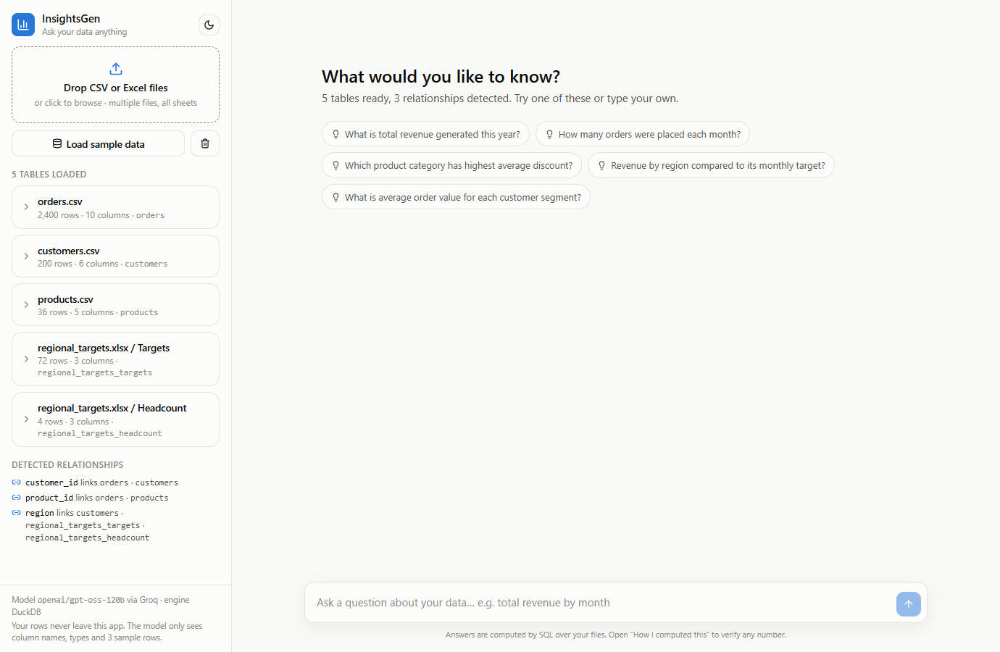
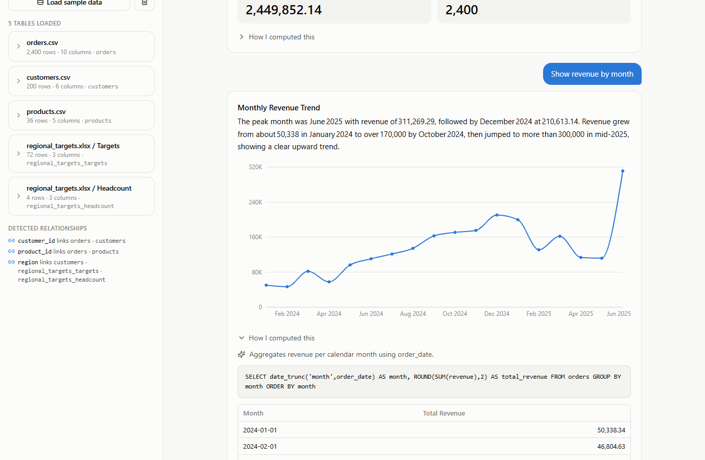
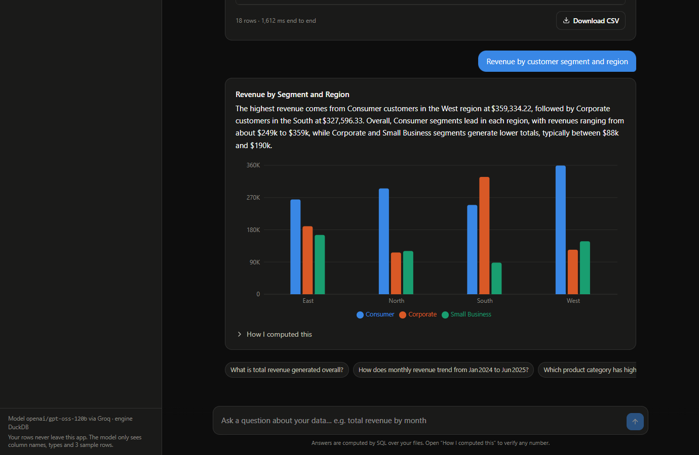

# InsightsGen

Upload CSV or Excel files and ask questions about them in plain English. Every answer is computed exactly by SQL, shown with the query that produced it, and charted when the result's shape calls for it.



## What it does

| Requirement | How InsightsGen meets it |
|---|---|
| Multi-file upload | Any number of CSV / TSV / XLSX files in one session. Every Excel sheet becomes its own table. |
| Cross-file analysis | Columns shared across files are detected and shown as relationships. Questions spanning files become SQL joins. |
| Visual insights | KPI tiles, line, bar, grouped bar and scatter charts, chosen by rules on the result's shape. |
| Delta on top of the model | Exact computation via DuckDB, self-healing queries, "How I computed this" transparency, auto-profiling with data cleaning, suggested questions, clarification instead of guessing, follow-up memory, and a golden-question eval suite. |



## How it works

```
question ──> LLM plans SQL from the schema only ──> guard (read-only) ──> DuckDB runs it
                 (never sees your rows)                                       │
   ┌──────────────────── on error: feed error back, retry up to 2x ───────────┘
   │
   └──> result table ──> chart rules pick the form ──> LLM phrases it in English ──> answer card
```

1. **Load and profile.** Files become pandas DataFrames, column names are made SQL-safe, currency strings and ISO dates are converted, and a compact schema summary is built (types, ranges, three sample rows, join keys).
2. **Plan.** `openai/gpt-oss-120b` on Groq receives the schema and the question and returns JSON: SQL, a chart hint, a one-line explanation, and optionally a clarifying question.
3. **Guard and run.** The SQL must be a single `SELECT`; DuckDB runs with external file access disabled and results are capped at 1,000 rows.
4. **Heal.** If DuckDB errors, the error goes back to the model for a fix. Up to two repairs.
5. **Chart.** Deterministic rules on the result decide KPI / line / bar / grouped bar / scatter / table. The frontend only renders the spec.
6. **Narrate.** A smaller model (`qwen/qwen3.8-27b`) turns the result into two or three sentences, using a whole-result digest so a long table cannot mislead it.

The model never receives your data. It sees column names, inferred types, value ranges and three sample rows.

## Quick start

Prerequisites: Python 3.12+, Node 22+, and a free [Groq API key](https://console.groq.com).

```bash
git clone <this repo> && cd InsightsGen
python -m venv .venv
.\.venv\Scripts\Activate.ps1                        # Windows PowerShell (macOS/Linux: source .venv/bin/activate)
pip install -r requirements.txt
cp .env.example .env                                # then paste your GROQ_API_KEY into .env

cd frontend && npm install && npm run build && cd ..
uvicorn api.main:app --port 8000
```

If PowerShell blocks the activation script, run `Set-ExecutionPolicy -Scope Process -ExecutionPolicy Bypass` first, or skip activation and use `.\.venv\Scripts\python.exe -m uvicorn api.main:app --port 8000`.

Open http://localhost:8000, click **Load sample data**, and ask something.

**Frontend development** with hot reload (API on 8000, Vite on 5173 proxies `/api`):

```bash
uvicorn api.main:app --port 8000 --reload
cd frontend && npm run dev
```

**Alternative lightweight UI** (same core, Streamlit, deploys to Streamlit Community Cloud in minutes):

```bash
streamlit run app.py
```

## Configuration

| Variable | Default | Purpose |
|---|---|---|
| `GROQ_API_KEY` | required | Groq API key |
| `GROQ_MODEL` | `openai/gpt-oss-120b` | Planner model (writes SQL). Any open-weight chat model on Groq works. |
| `GROQ_NARRATOR_MODEL` | `qwen/qwen3.8-27b` | Narration and suggested questions. Separate rate-limit quota. |
| `MAX_UPLOAD_MB` | `100` | Per-file upload limit |
| `SESSION_TTL_SECONDS` | `7200` | Idle time before an in-memory session is evicted |

## Tests and evaluation

```bash
pytest tests/test_units.py          # 35 offline tests: loader, profiler, SQL guard, chart rules
pytest tests/test_eval.py -v        # 15 golden questions through the live pipeline
python scripts/run_eval.py          # same eval, prints a table and writes tests/eval_results.md
```

The golden questions have answers computed independently with pandas in `tests/golden.py`. The pipeline's result must contain the right numbers (and, for rankings, the right label in the first row).

Latest run, `openai/gpt-oss-120b`:

| Result | Count |
|---|---|
| Passed | 15 of 15 |
| Passed via self-healing (first SQL failed, repaired automatically) | 1 |
| Typical end-to-end latency | 1 to 2 s |

Latency rises to around 10 s when many questions are fired back to back on Groq's free tier, which throttles by tokens per minute. Splitting planner and narrator across two models reduces this; a paid tier removes it.



## Deploy

The Dockerfile builds the frontend and serves everything from one container.

```bash
docker build -t insightsgen .
docker run -p 8000:8000 -e GROQ_API_KEY=... insightsgen
```

- **Render** (free tier): New Web Service, connect the repo, runtime Docker, add `GROQ_API_KEY` under Environment. Render injects `PORT` automatically.
- **Hugging Face Spaces**: create a Docker Space, push the repo, set `GROQ_API_KEY` as a secret and `PORT=7860` as a variable.
- **Streamlit Community Cloud** (alternative UI): point it at `app.py` and paste `GROQ_API_KEY` into Secrets.

Sessions are in memory, so run a single instance or add sticky sessions.

## Project structure

```
core/               Everything that is not UI. No web framework imports.
  loader.py         CSV / multi-sheet Excel -> DataFrames with SQL-safe names
  profiler.py       cleaning, type inference, schema summary, join-key detection
  engine.py         DuckDB wrapper + read-only SQL guard + row cap
  llm.py            Groq: plan SQL, repair SQL, narrate, suggest questions
  charts.py         result shape -> chart spec (+ Plotly figure for Streamlit)
  pipeline.py       Workspace: add_files(), ask(), suggestions(), cache, history
api/main.py         FastAPI: sessions, upload, ask; serves frontend/dist
frontend/           Vite + React + TypeScript + Tailwind + Recharts
app.py              Streamlit alternative UI over the same core
sample_data/        Linked demo dataset (orders, customers, products, targets.xlsx)
tests/              Unit tests, golden questions, pandas ground truth
scripts/            Sample data generator and eval runner
```

## Design decisions

In short: correctness comes from letting a database do the arithmetic; safety comes from read-only SQL in a locked-down engine; trust comes from showing the query; robustness comes from feeding errors back to the model; and confidence comes from an eval with independently computed answers.

## Limitations

- Join detection needs identical column names. `customer_id` and `cust_id` are not matched yet.
- Sessions live in memory and expire after two hours of inactivity.
- Files must fit in memory. DuckDB handles millions of rows comfortably, but there is no disk spill yet.
- The model can still misread an ambiguous question. The SQL is always shown so the reader can catch it.
